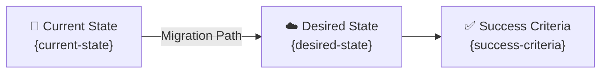

# 📋 Step 1: Requirements - {project-name}

<strong>📑 Requirements Overview</strong>

- [🎯 Project Overview](#-project-overview)
- [🚀 Functional Requirements](#-functional-requirements)
- [⚡ Non-Functional Requirements (NFRs)](#-non-functional-requirements-nfrs)
- [🔒 Compliance & Security Requirements](#-compliance--security-requirements)
- [💰 Budget](#-budget)
- [🔧 Operational Requirements](#-operational-requirements)
- [🌍 Regional Preferences](#-regional-preferences)
- [📊 Complexity Classification](#-complexity-classification)
- [📋 Summary for Architecture Assessment](#-summary-for-architecture-assessment)
- [References](#references)

> Generated by @requirements agent | {date}

| ⬅️ Previous | 📑 Index            | Next ➡️                                                        |
| ----------- | ------------------- | -------------------------------------------------------------- |
| —           | [README](README.md) | [02-architecture-assessment.md](02-architecture-assessment.md) |

## 🎯 Project Overview

| Field                   | Value                                                    |
| ----------------------- | -------------------------------------------------------- |
| **Project Name**        | {project-name}                                           |
| **Project Type**        | {Static Site / API Backend / Full-Stack / Data Platform} |
| **Timeline**            | {Start date} → {Target go-live}                          |
| **Primary Stakeholder** | {name / role}                                            |
| **Business Context**    | {one-line summary}                                       |

### Business Context

Capture the business context gathered during Phase 1 discovery:

| Field               | Value                                                          |
| ------------------- | -------------------------------------------------------------- |
| Industry / Vertical | {Retail, Healthcare, Financial Services, etc.}                 |
| Company Size        | {Startup, Mid-Market, Enterprise}                              |
| Current State       | {Greenfield / Migration / Modernization / Extension}           |
| Migration Source    | {On-prem, other cloud, legacy platform — or N/A if greenfield} |
| Business Drivers    | {Why this project? Cost savings, growth, compliance, etc.}     |
| Success Criteria    | {How will business success be measured?}                       |

### State Transition

## 🚀 Functional Requirements

### Core Capabilities

| #   | Capability   | Priority                       | Acceptance Criteria    |
| --- | ------------ | ------------------------------ | ---------------------- |
| 1   | {capability} | 🔴 Must / 🟡 Should / 🟢 Could | {measurable criterion} |
| 2   | {capability} | 🔴 Must / 🟡 Should / 🟢 Could | {measurable criterion} |

### User Types

| User Type | Description   | Est. Count | Access Level                   |
| --------- | ------------- | ---------- | ------------------------------ |
| {type}    | {description} | {count}    | {Admin / Contributor / Reader} |

### Integrations

| System   | Direction                          | Protocol            | Auth Method            | SLA   |
| -------- | ---------------------------------- | ------------------- | ---------------------- | ----- |
| {system} | Inbound / Outbound / Bidirectional | REST / gRPC / Event | {OAuth / API Key / MI} | {SLA} |

### Data Types

| Category   | Sensitivity                  | Est. Volume | Retention | Residency |
| ---------- | ---------------------------- | ----------- | --------- | --------- |
| {category} | 🔴 High / 🟡 Medium / 🟢 Low | {volume}    | {period}  | {region}  |

### Architecture Pattern

| Field              | Value                                                  |
| ------------------ | ------------------------------------------------------ |
| Workload Pattern   | {Static Site / N-Tier / API-First / Serverless / Data} |
| Recommended Option | {Option from Service Recommendation Matrix}            |
| Tier               | {Cost-Optimized / Balanced / Enterprise}               |
| Justification      | {Why this pattern fits the requirements}               |

## ⚡ Non-Functional Requirements (NFRs)

| WAF Pillar     | Metric             | Target                    | Current          | Gap   |
| -------------- | ------------------ | ------------------------- | ---------------- | ----- |
| 🔄 Reliability | SLA                | {target %}                | {current or N/A} | {gap} |
| 🔄 Reliability | RTO                | {target}                  | {current or N/A} | {gap} |
| 🔄 Reliability | RPO                | {target}                  | {current or N/A} | {gap} |
| ⚡ Performance | Page Load          | {target ms}               | {current or N/A} | {gap} |
| ⚡ Performance | API Response (p95) | {target ms}               | {current or N/A} | {gap} |
| ⚡ Performance | Concurrent Users   | {target}                  | {current or N/A} | {gap} |
| 🔒 Security    | Auth Method        | {MFA / SSO / Certificate} | —                | —     |
| 🔒 Security    | Encryption         | {At-rest + In-transit}    | —                | —     |
| 💰 Cost        | Monthly Budget     | {amount}                  | —                | —     |
| 🔧 Operations  | Uptime Monitoring  | {Yes / No}                | —                | —     |

### Scalability

| Dimension        | Current | 6-Month Projection | 12-Month Projection |
| ---------------- | ------- | ------------------ | ------------------- |
| Users            | {count} | {count}            | {count}             |
| Data Volume      | {size}  | {size}             | {size}              |
| Transactions/day | {count} | {count}            | {count}             |

## 🔒 Compliance & Security Requirements

### Regulatory Frameworks

<strong>PCI-DSS</strong> — {Applicable / Not Applicable}

| Requirement             | Applicability | Notes     |
| ----------------------- | ------------- | --------- |
| Cardholder data storage | {Yes / No}    | {details} |
| Network segmentation    | {Yes / No}    | {details} |
| Encryption requirements | {Yes / No}    | {details} |

<strong>SOC 2</strong> — {Applicable / Not Applicable}

| Trust Principle | Applicability | Notes     |
| --------------- | ------------- | --------- |
| Security        | {Yes / No}    | {details} |
| Availability    | {Yes / No}    | {details} |
| Confidentiality | {Yes / No}    | {details} |

<strong>HIPAA</strong> — {Applicable / Not Applicable}

| Requirement   | Applicability | Notes     |
| ------------- | ------------- | --------- |
| PHI handling  | {Yes / No}    | {details} |
| BAA required  | {Yes / No}    | {details} |
| Audit logging | {Yes / No}    | {details} |

<strong>GDPR</strong> — {Applicable / Not Applicable}

| Requirement      | Applicability | Notes     |
| ---------------- | ------------- | --------- |
| EU data subjects | {Yes / No}    | {details} |
| Data residency   | {Yes / No}    | {details} |
| Right to erasure | {Yes / No}    | {details} |

<strong>ISO 27001</strong> — {Applicable / Not Applicable}

| Control Area        | Applicability | Notes     |
| ------------------- | ------------- | --------- |
| Access control      | {Yes / No}    | {details} |
| Asset management    | {Yes / No}    | {details} |
| Incident management | {Yes / No}    | {details} |

### Data Residency

| Requirement              | Value                                         |
| ------------------------ | --------------------------------------------- |
| Primary Region           | {region}                                      |
| Data Sovereignty         | {EU-only / No restriction / Country-specific} |
| Cross-region Replication | {Required / Not required}                     |

### Authentication & Authorization

| Requirement       | Value                                     |
| ----------------- | ----------------------------------------- |
| Identity Provider | {Entra ID / B2C / External IdP}           |
| MFA Requirement   | {Required / Conditional / Not required}   |
| RBAC Model        | {Azure RBAC / Custom / Application-level} |

### Network Security

| Control                     | Required | Notes     |
| --------------------------- | -------- | --------- |
| Private endpoints           | ✅ / ❌  | {details} |
| VNet integration            | ✅ / ❌  | {details} |
| Public endpoints acceptable | ✅ / ❌  | {details} |
| WAF required                | ✅ / ❌  | {details} |

### Recommended Security Controls

Table of recommended controls based on workload pattern and compliance requirements:

| Control               | Recommended | User Confirmed | Notes                   |
| --------------------- | ----------- | -------------- | ----------------------- |
| Managed Identity      | {yes/no}    | {yes/no}       | {Prefer over keys}      |
| Private Endpoints     | {yes/no}    | {yes/no}       | {For data services}     |
| WAF                   | {yes/no}    | {yes/no}       | {For public endpoints}  |
| Key Vault for Secrets | {yes/no}    | {yes/no}       | {Centralized secrets}   |
| Diagnostic Settings   | {yes/no}    | {yes/no}       | {Audit logging}         |
| TLS 1.2 Minimum       | {yes/no}    | {yes/no}       | {Always recommended}    |
| Encryption at Rest    | {yes/no}    | {yes/no}       | {Platform default}      |
| Network Isolation     | {yes/no}    | {yes/no}       | {VNet/NSG/Private Link} |

## 💰 Budget

> [!NOTE]
> The Azure Pricing MCP server generates detailed cost estimates during
> architecture assessment (Step 2). Provide an approximate budget here.

| Field              | Value                                               |
| ------------------ | --------------------------------------------------- |
| 💰 Monthly Budget  | {approximate amount, e.g., ~$50}                    |
| 📅 Annual Budget   | {optional — monthly × 12 if not specified}          |
| 🚦 Limit Type      | {🔴 Hard = cannot exceed / 🟡 Soft = can negotiate} |
| 📊 Cost Model Pref | {Consumption / Committed / Hybrid}                  |

### Cost Optimization Priorities

| Priority                         | Selected | Impact                |
| -------------------------------- | -------- | --------------------- |
| Minimize compute costs           | ☐        | {High / Medium / Low} |
| Prefer consumption-based pricing | ☐        | {High / Medium / Low} |
| Reserved instances acceptable    | ☐        | {High / Medium / Low} |
| Spot instances for non-critical  | ☐        | {High / Medium / Low} |

## 🔧 Operational Requirements

### Monitoring & Alerting

| Capability             | Required | Tool / Service              | Notes        |
| ---------------------- | -------- | --------------------------- | ------------ |
| Application monitoring | ✅ / ❌  | Application Insights        | {details}    |
| Log aggregation        | ✅ / ❌  | Log Analytics               | {details}    |
| Alert notifications    | ✅ / ❌  | {Email / Teams / PagerDuty} | {recipients} |
| Custom dashboards      | ✅ / ❌  | Azure Monitor / Grafana     | {details}    |

### Support & Maintenance

| Requirement         | Value                                       |
| ------------------- | ------------------------------------------- |
| Support Hours       | {24/7 / Business hours / Best-effort}       |
| On-call Requirement | {Yes / No}                                  |
| Maintenance Windows | {Day / Time / Frequency}                    |
| Change Management   | {Formal CAB / Team approval / Self-service} |

### Backup & Disaster Recovery

| Component   | Backup Frequency              | Retention         | Recovery Method      |
| ----------- | ----------------------------- | ----------------- | -------------------- |
| {component} | {Daily / Hourly / Continuous} | {30d / 90d / 1yr} | {Automated / Manual} |

## 🌍 Regional Preferences

| Preference         | Value                               | Justification                    |
| ------------------ | ----------------------------------- | -------------------------------- |
| Primary Region     | swedencentral                       | {default — override if required} |
| Failover Region    | {region or N/A}                     | {compliance / latency / cost}    |
| Availability Zones | {Required / Preferred / Not needed} | {SLA / cost trade-off}           |

---

## 📊 Complexity Classification

| Field      | Value                                                |
| ---------- | ---------------------------------------------------- |
| Complexity | `simple` / `standard` / `complex`                    |
| Criteria   | simple: ≤3 resources, no custom policies, single env |
|            | standard: 4-20 resources                             |
|            | complex: 20+ resources or PCI-DSS/SOC2 compliance    |
| Rationale  | {explain why this classification was chosen}         |

---

## 📋 Summary for Architecture Assessment

### Handoff Summary

| Aspect               | Key Points                                                    |
| -------------------- | ------------------------------------------------------------- |
| Critical Constraints | {top 3 constraints driving architecture}                      |
| Key Decisions        | {decisions made during requirements that affect architecture} |
| Open Risks           | {unresolved items that architect must address}                |
| Recommended Pattern  | {workload pattern from Functional Requirements}               |
| Budget Envelope      | {monthly budget from Budget section}                          |

### Requirements Completeness

| Section                  | Status       | Notes   |
| ------------------------ | ------------ | ------- |
| Project Overview         | ✅ / ⚠️ / ❌ | {notes} |
| Functional Requirements  | ✅ / ⚠️ / ❌ | {notes} |
| NFRs                     | ✅ / ⚠️ / ❌ | {notes} |
| Compliance & Security    | ✅ / ⚠️ / ❌ | {notes} |
| Budget                   | ✅ / ⚠️ / ❌ | {notes} |
| Operational Requirements | ✅ / ⚠️ / ❌ | {notes} |

---

## References

> [!NOTE]
> 📚 The following Microsoft Learn resources provide additional guidance.

| Topic                      | Link                                                                                                |
| -------------------------- | --------------------------------------------------------------------------------------------------- |
| Well-Architected Framework | [Overview](https://learn.microsoft.com/azure/well-architected/)                                     |
| Azure Regions              | [Products by Region](https://azure.microsoft.com/explore/global-infrastructure/products-by-region/) |
| Compliance Offerings       | [Azure Compliance](https://learn.microsoft.com/azure/compliance/)                                   |

---

_Requirements captured using [plan-requirements.prompt.md](../../.github/prompts/plan-requirements.prompt.md) template_

---

| ⬅️ — | 🏠 [Project Index](README.md) | ➡️ [02-architecture-assessment.md](02-architecture-assessment.md) |
| ---- | ----------------------------- | ----------------------------------------------------------------- |

