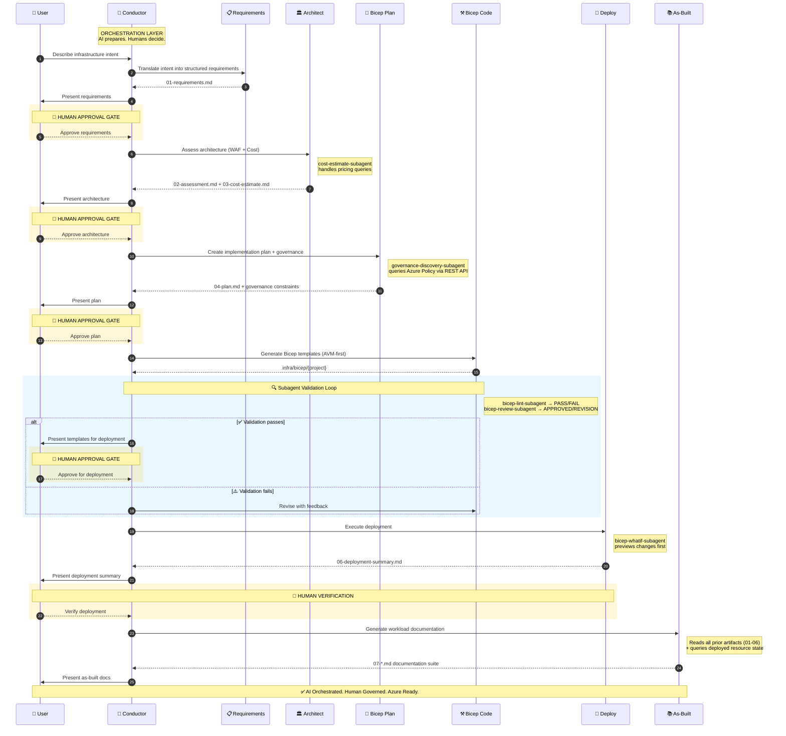

<!-- markdownlint-disable MD013 MD033 MD041 -->

# Agentic InfraOps Accelerator

<div align="center">
  
</div>

> **Modernize your Azure Infrastructure with AI.** A production-ready template for building Well-Architected
> environments using custom Copilot agents, Dev Containers, and the Model Context Protocol (MCP).

[](https://azure.microsoft.com)
[](https://github.com/Azure/bicep)
[](https://github.com/features/copilot)
[](LICENSE)

## Overview

This accelerator provides the scaffolding and governance to move from requirements to deployed infrastructure
using an orchestrated workflow. It leverages domain-specific AI agents to ensure every deployment is
Well-Architected, governed, and documented.

---

## Multi-Agent Workflow

Agentic InfraOps coordinates specialized AI agents through a complete infrastructure development cycle.
Invoke the **InfraOps Conductor** (`Ctrl+Shift+I`) to begin.



---

## Quick Start

### 1. Create Your Repository

This repository is a **GitHub Template**. To use it for your project:

1. Click **"Use this template"** > **"Create a new repository"** at the top of the GitHub page.
2. Clone your new repository to your local machine.
3. Open the folder in **VS Code**.

### 2. Launch the Environment

1. When prompted by VS Code (bottom-right), click **"Reopen in Container"**.
2. Wait for the environment to build (3-5 minutes). This pre-installs the Azure CLI, Bicep, Python, and the Pricing MCP.
3. In the VS Code Terminal, run `az login` to authenticate with Azure.

### 3. Initial Setup

After the Dev Container starts, run the following to install dependencies and sync the latest
workflow files from the parent project:

```bash
npm install
npm run sync:workflows
```

The `sync:workflows` script fetches the latest GitHub Actions workflows from the
[parent project](https://github.com/jonathan-vella/azure-agentic-infraops) and copies them into
your `.github/workflows/` directory. Review the changes with `git diff` before committing.

> **Why a manual step?** GitHub Actions tokens cannot push workflow file changes.
> By running this locally, your personal credentials handle the push.

### 4. Deploy Your First Project

1. Select the **InfraOps Conductor** agent from the Copilot Chat (`Ctrl+Shift+I`).
2. Describe your infrastructure intent to start the 7-step orchestrated workflow.
3. Follow the agent's guidance through requirements, architecture, and deployment.

---

## Keeping Up to Date

| What                                        | How                                          | Frequency      |
| ------------------------------------------- | -------------------------------------------- | -------------- |
| Agents, skills, instructions, docs, scripts | Automated weekly PR (upstream sync workflow) | Weekly         |
| GitHub Actions workflows                    | `npm run sync:workflows` (manual)            | As needed      |
| All validations                             | `npm run validate:all`                       | Before each PR |

---

## Validation & Quality

Keep your repository healthy using built-in validation tools:

```bash
# Run all code and documentation lints
npm run validate:all

# Automatically fix markdown formatting issues
npm run lint:md:fix
```

---

## Project Structure

| Path                 | Purpose                                                                 |
| -------------------- | ----------------------------------------------------------------------- |
| `.github/agents/`    | Domain-specific Copilot agent definitions                               |
| `.github/workflows/` | GitHub Actions workflows (synced manually via `npm run sync:workflows`) |
| `agent-output/`      | **Your work**: Generated artifacts (requirements, diagrams, docs)       |
| `infra/bicep/`       | **Your code**: Project-specific infrastructure templates                |
| `mcp/`               | Model Context Protocol servers (e.g., Azure Pricing)                    |

---

## Resources

- [Main Azure Agentic InfraOps Repo](https://github.com/jonathan-vella/azure-agentic-infraops)
- [MicroHack](https://jonathan-vella.github.io/azure-agentic-infraops/)
- [Prompt Guide](https://github.com/jonathan-vella/azure-agentic-infraops/tree/main/docs/prompt-guide)

## License

[MIT](LICENSE)
