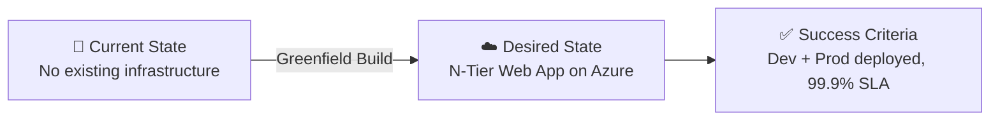

# 📋 Step 1: Requirements - my-webapp

<strong>📑 Requirements Overview</strong>

- [🎯 Project Overview](#-project-overview)
- [🚀 Functional Requirements](#-functional-requirements)
- [⚡ Non-Functional Requirements (NFRs)](#-non-functional-requirements-nfrs)
- [🔒 Compliance & Security Requirements](#-compliance--security-requirements)
- [💰 Budget](#-budget)
- [🔧 Operational Requirements](#-operational-requirements)
- [🌍 Regional Preferences](#-regional-preferences)
- [📊 Complexity Classification](#-complexity-classification)
- [📋 Summary for Architecture Assessment](#-summary-for-architecture-assessment)
- [References](#references)

> Generated by @requirements agent | 2026-03-12

| ⬅️ Previous | 📑 Index            | Next ➡️                                                        |
| ----------- | ------------------- | -------------------------------------------------------------- |
| —           | [README](README.md) | [02-architecture-assessment.md](02-architecture-assessment.md) |

## 🎯 Project Overview

| Field                   | Value                                                                                |
| ----------------------- | ------------------------------------------------------------------------------------ |
| **Project Name**        | my-webapp                                                                            |
| **Project Type**        | Full-Stack (N-Tier Web Application)                                                  |
| **Timeline**            | March 2026 → Target go-live TBD with stakeholder                                     |
| **Primary Stakeholder** | Project Owner (to be confirmed)                                                      |
| **Business Context**    | Simple web application with App Service frontend, Azure SQL data tier, and Key Vault |
| **IaC Tool**            | Bicep                                                                                |

### Business Context

| Field               | Value                                                                |
| ------------------- | -------------------------------------------------------------------- |
| Industry / Vertical | Technology / SaaS                                                    |
| Company Size        | Mid-Market (51–500 employees)                                        |
| Current State       | Greenfield                                                           |
| Migration Source    | N/A (greenfield)                                                     |
| Business Drivers    | New product capability — web application for internal/external users |
| Success Criteria    | Successful deployment to Dev and Production with 99.9% SLA target    |

### State Transition

## 🚀 Functional Requirements

### Core Capabilities

| #   | Capability                                  | Priority  | Acceptance Criteria                                           |
| --- | ------------------------------------------- | --------- | ------------------------------------------------------------- |
| 1   | Web frontend hosting via App Service        | 🔴 Must   | App Service responds to HTTPS requests with <2s load time     |
| 2   | Relational data storage via Azure SQL       | 🔴 Must   | SQL Database accessible from App Service via managed identity |
| 3   | Centralized secret management via Key Vault | 🔴 Must   | All secrets stored in Key Vault, no hardcoded credentials     |
| 4   | Application performance monitoring          | 🟡 Should | Application Insights integrated with App Service              |
| 5   | Centralized log aggregation                 | 🟡 Should | Log Analytics workspace collecting diagnostic logs            |
| 6   | Environment separation (Dev / Production)   | 🔴 Must   | Separate resource groups per environment                      |

### User Types

| User Type      | Description                           | Est. Count | Access Level |
| -------------- | ------------------------------------- | ---------- | ------------ |
| End Users      | Web application consumers             | 100–1,000  | Reader       |
| Administrators | Application and infrastructure admins | 5–10       | Admin        |
| Developers     | Application development team          | 10–20      | Contributor  |

### Integrations

| System               | Direction | Protocol | Auth Method              | SLA   |
| -------------------- | --------- | -------- | ------------------------ | ----- |
| Azure SQL Database   | Outbound  | TDS      | Managed Identity         | 99.9% |
| Key Vault            | Outbound  | REST     | Managed Identity         | 99.9% |
| Application Insights | Outbound  | REST     | Connection String via KV | 99.9% |

### Data Types

| Category         | Sensitivity | Est. Volume | Retention  | Residency     |
| ---------------- | ----------- | ----------- | ---------- | ------------- |
| Business data    | 🟡 Medium   | <10 GB      | 1 year     | swedencentral |
| Application logs | 🟢 Low      | <5 GB/month | 90 days    | swedencentral |
| Secrets/keys     | 🔴 High     | <1 MB       | Indefinite | swedencentral |

### Architecture Pattern

| Field              | Value                                                                                                                                                                                                               |
| ------------------ | ------------------------------------------------------------------------------------------------------------------------------------------------------------------------------------------------------------------- |
| Workload Pattern   | N-Tier (layered web application)                                                                                                                                                                                    |
| Recommended Option | App Svc S1 + SQL S1 + Redis + KV (Balanced tier from service matrix)                                                                                                                                                |
| Tier               | Balanced (Standard tiers)                                                                                                                                                                                           |
| Justification      | Mid-market SaaS with 100–1K users fits Balanced tier; Standard SKUs provide production-ready performance, SLA guarantees, and reasonable cost within the €500–€2K/month budget. Redis deferred as optional stretch. |

## ⚡ Non-Functional Requirements (NFRs)

| WAF Pillar     | Metric             | Target                          | Current | Gap        |
| -------------- | ------------------ | ------------------------------- | ------- | ---------- |
| 🔄 Reliability | SLA                | 99.9%                           | N/A     | Greenfield |
| 🔄 Reliability | RTO                | 4 hours                         | N/A     | Greenfield |
| 🔄 Reliability | RPO                | 1 hour                          | N/A     | Greenfield |
| ⚡ Performance | Page Load          | <2,000 ms                       | N/A     | Greenfield |
| ⚡ Performance | API Response (p95) | <500 ms                         | N/A     | Greenfield |
| ⚡ Performance | Concurrent Users   | 100–1,000                       | N/A     | Greenfield |
| 🔒 Security    | Auth Method        | Entra ID SSO                    | —       | —          |
| 🔒 Security    | Encryption         | At-rest + In-transit (TLS 1.2+) | —       | —          |
| 💰 Cost        | Monthly Budget     | €500–€2,000                     | —       | —          |
| 🔧 Operations  | Uptime Monitoring  | Yes                             | —       | —          |

### Scalability

| Dimension        | Current | 6-Month Projection | 12-Month Projection |
| ---------------- | ------- | ------------------ | ------------------- |
| Users            | 100–500 | 500–1,000          | 1,000–2,000         |
| Data Volume      | <5 GB   | 5–10 GB            | 10–20 GB            |
| Transactions/day | ~5,000  | ~10,000            | ~20,000             |

## 🔒 Compliance & Security Requirements

### Regulatory Frameworks

<strong>PCI-DSS</strong> — Not Applicable

No payment card data handled by this application.

<strong>SOC 2</strong> — Applicable

| Trust Principle | Applicability | Notes                                         |
| --------------- | ------------- | --------------------------------------------- |
| Security        | Yes           | Access controls, encryption, managed identity |
| Availability    | Yes           | 99.9% SLA target with monitoring              |
| Confidentiality | Yes           | Secrets in Key Vault, TLS for data in transit |

<strong>HIPAA</strong> — Not Applicable

No protected health information (PHI) handled.

<strong>GDPR</strong> — Applicable

| Requirement      | Applicability | Notes                                           |
| ---------------- | ------------- | ----------------------------------------------- |
| EU data subjects | Yes           | Application likely serves EU users              |
| Data residency   | Yes           | All data in swedencentral (EU)                  |
| Right to erasure | Yes           | Application must support data deletion requests |

<strong>ISO 27001</strong> — Not Applicable

Not currently required; may consider for future certification.

### Data Residency

| Requirement              | Value         |
| ------------------------ | ------------- |
| Primary Region           | swedencentral |
| Data Sovereignty         | EU-only       |
| Cross-region Replication | Not required  |

### Authentication & Authorization

| Requirement       | Value                                                          |
| ----------------- | -------------------------------------------------------------- |
| Identity Provider | Microsoft Entra ID (Azure AD)                                  |
| MFA Requirement   | Conditional (per Entra ID policies)                            |
| RBAC Model        | Azure RBAC for infrastructure, application-level for end users |

### Network Security

| Control                     | Required | Notes                                                           |
| --------------------------- | -------- | --------------------------------------------------------------- |
| Private endpoints           | ❌       | Not required for Balanced tier; consider for Production upgrade |
| VNet integration            | ❌       | Not required initially; consider for Production                 |
| Public endpoints acceptable | ✅       | Acceptable for dev; review for production hardening             |
| WAF required                | ❌       | Not required at current scale                                   |

### Recommended Security Controls

| Control               | Recommended | User Confirmed | Notes                                           |
| --------------------- | ----------- | -------------- | ----------------------------------------------- |
| Managed Identity      | Yes         | Yes            | Service-to-service auth for SQL and KV          |
| Private Endpoints     | No          | No             | Not in scope for initial deployment             |
| WAF                   | No          | No             | Not required at current scale                   |
| Key Vault for Secrets | Yes         | Yes            | Centralized secret storage                      |
| Diagnostic Settings   | Yes         | Yes            | Log Analytics + Application Insights            |
| TLS 1.2 Minimum       | Yes         | Yes            | Enforced on all services                        |
| Encryption at Rest    | Yes         | Yes            | Platform-managed keys (default)                 |
| Network Isolation     | No          | No             | Deferred; public endpoints acceptable initially |

## 💰 Budget

> [!NOTE]
> The Azure Pricing MCP server generates detailed cost estimates during
> architecture assessment (Step 2). Provide an approximate budget here.

| Field              | Value                      |
| ------------------ | -------------------------- |
| 💰 Monthly Budget  | €500–€2,000                |
| 📅 Annual Budget   | €6,000–€24,000             |
| 🚦 Limit Type      | 🟡 Soft (can negotiate)    |
| 📊 Cost Model Pref | Consumption where possible |

### Cost Optimization Priorities

| Priority                         | Selected | Impact |
| -------------------------------- | -------- | ------ |
| Minimize compute costs           | ☐        | Medium |
| Prefer consumption-based pricing | ☑        | High   |
| Reserved instances acceptable    | ☐        | Medium |
| Spot instances for non-critical  | ☐        | Low    |

## 🔧 Operational Requirements

### Monitoring & Alerting

| Capability             | Required | Tool / Service       | Notes                   |
| ---------------------- | -------- | -------------------- | ----------------------- |
| Application monitoring | ✅       | Application Insights | APM for App Service     |
| Log aggregation        | ✅       | Log Analytics        | Centralized diagnostics |
| Alert notifications    | ✅       | Email                | Team email distribution |
| Custom dashboards      | ❌       | —                    | Not required initially  |

### Support & Maintenance

| Requirement         | Value               |
| ------------------- | ------------------- |
| Support Hours       | Business hours      |
| On-call Requirement | No                  |
| Maintenance Windows | Weekends, off-hours |
| Change Management   | Team approval       |

### Backup & Disaster Recovery

| Component   | Backup Frequency  | Retention | Recovery Method       |
| ----------- | ----------------- | --------- | --------------------- |
| Azure SQL   | Automated (Azure) | 35 days   | Point-in-time restore |
| Key Vault   | Soft delete       | 90 days   | Recovery via Azure    |
| App Service | N/A (stateless)   | —         | Redeploy from IaC     |

## 🌍 Regional Preferences

| Preference         | Value         | Justification                           |
| ------------------ | ------------- | --------------------------------------- |
| Primary Region     | swedencentral | EU GDPR-compliant, user-selected        |
| Failover Region    | N/A           | Not required for initial deployment     |
| Availability Zones | Not needed    | Standard tier sufficient for SLA target |

---

## 📊 Complexity Classification

| Field      | Value                                                                                                                                                                                                 |
| ---------- | ----------------------------------------------------------------------------------------------------------------------------------------------------------------------------------------------------- |
| Complexity | `simple`                                                                                                                                                                                              |
| Criteria   | ≤3 core resource types (App Service, SQL Database, Key Vault), single region, no custom policies, two environments (Dev + Prod)                                                                       |
| Rationale  | Three primary Azure services in a single region with standard security controls and no custom Azure Policy requirements. Two environments (Dev, Production) with straightforward N-Tier architecture. |

---

## 📋 Summary for Architecture Assessment

### Handoff Summary

| Aspect               | Key Points                                                              |
| -------------------- | ----------------------------------------------------------------------- |
| Critical Constraints | €500–€2K budget, swedencentral region, GDPR + SOC 2 compliance          |
| Key Decisions        | Bicep IaC, Balanced tier, Managed Identity, Entra ID auth, N-Tier       |
| Open Risks           | Production hardening (private endpoints, VNet) deferred to future phase |
| Recommended Pattern  | N-Tier (App Svc S1 + SQL S1 + KV)                                       |
| Budget Envelope      | €500–€2,000/month                                                       |

### Requirements Completeness

| Section                  | Status | Notes                                  |
| ------------------------ | ------ | -------------------------------------- |
| Project Overview         | ✅     | All fields populated                   |
| Functional Requirements  | ✅     | 6 capabilities with priorities         |
| NFRs                     | ✅     | SLA, RTO, RPO, performance targets set |
| Compliance & Security    | ✅     | GDPR + SOC 2 with control matrix       |
| Budget                   | ✅     | €500–€2K range with optimization prefs |
| Operational Requirements | ✅     | Monitoring, backup, support defined    |

---

## References

> [!NOTE]
> 📚 The following Microsoft Learn resources provide additional guidance.

| Topic                      | Link                                                                                                |
| -------------------------- | --------------------------------------------------------------------------------------------------- |
| Well-Architected Framework | [Overview](https://learn.microsoft.com/azure/well-architected/)                                     |
| Azure Regions              | [Products by Region](https://azure.microsoft.com/explore/global-infrastructure/products-by-region/) |
| Compliance Offerings       | [Azure Compliance](https://learn.microsoft.com/azure/compliance/)                                   |

---

_Requirements captured using the Requirements agent interactive questioning workflow_

---

| ⬅️ — | 🏠 [Project Index](README.md) | ➡️ [02-architecture-assessment.md](02-architecture-assessment.md) |
| ---- | ----------------------------- | ----------------------------------------------------------------- |

