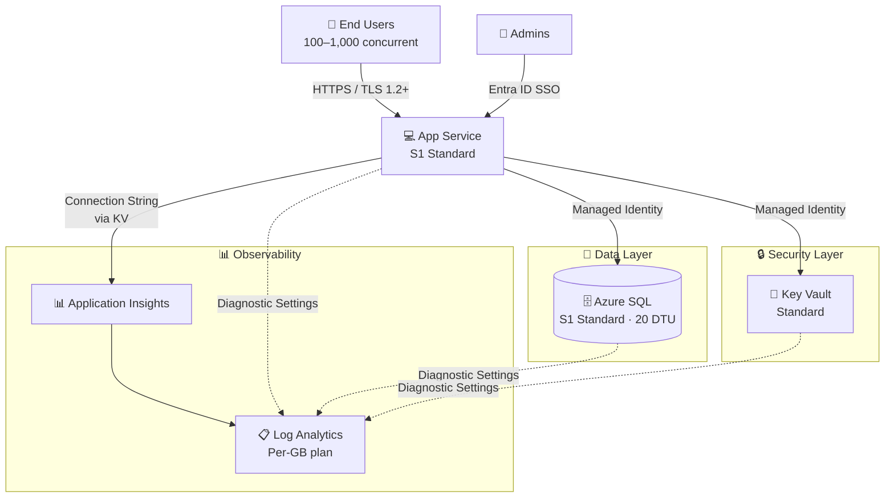
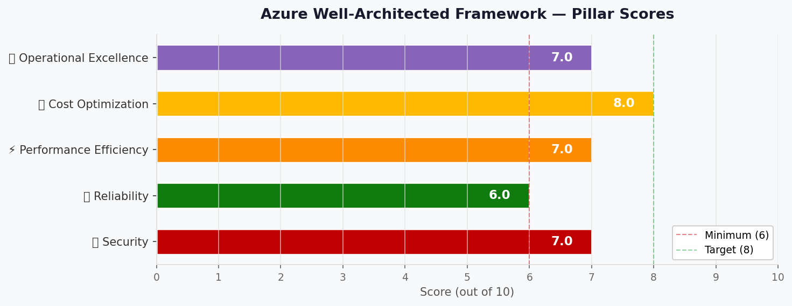

# 🏛️ Step 2: Architecture Assessment - my-webapp

<strong>📑 Assessment Contents</strong>

- [✅ Requirements Validation](#-requirements-validation)
- [💎 Executive Summary](#-executive-summary)
- [🏛️ WAF Pillar Assessment](#-waf-pillar-assessment)
- [📦 Resource SKU Recommendations](#-resource-sku-recommendations)
- [🎯 Architecture Decision Summary](#-architecture-decision-summary)
- [🚀 Implementation Handoff](#-implementation-handoff)
- [🔒 Approval Gate](#-approval-gate)
- [References](#references)

> Generated by architect agent | 2026-03-12

| ⬅️ Previous                              | 📑 Index            | Next ➡️                                            |
| ---------------------------------------- | ------------------- | -------------------------------------------------- |
| [01-requirements.md](01-requirements.md) | [README](README.md) | [03-des-cost-estimate.md](03-des-cost-estimate.md) |

## ✅ Requirements Validation

| Requirement Area        | Status     | Validation Notes                                                           |
| ----------------------- | ---------- | -------------------------------------------------------------------------- |
| NFRs (SLA, RTO, RPO)    | ✅ Defined | 99.9% SLA, 4h RTO, 1h RPO, <2s page load, <500ms API p95                   |
| Compliance requirements | ✅ Defined | GDPR (EU data residency in swedencentral) + SOC 2 (Security, Availability) |
| Budget (approximate)    | ✅ Defined | €500–€2,000/month soft limit, consumption-preferred                        |
| Scale requirements      | ✅ Defined | 100–1,000 concurrent users, 5–20K txns/day, <10 GB data                    |
| Security controls       | ✅ Defined | Managed Identity, Entra ID, TLS 1.2+, Key Vault, encryption at rest        |
| Data residency          | ✅ Defined | EU-only, swedencentral region, no cross-region replication                 |

> [!NOTE]
> All requirement areas validated. No blockers for architecture assessment.

---

## 💎 Executive Summary

This architecture delivers a **simple N-Tier web application** for a mid-market Technology/SaaS company. The design uses **Azure App Service** (S1 Standard) for the web frontend, **Azure SQL Database** (Standard S1, 20 DTU) for relational data, and **Azure Key Vault** (Standard) for centralized secret management. **Application Insights** and **Log Analytics** provide observability.

The architecture targets **99.9% composite SLA** (calculated: 99.95% × 99.99% × 99.99% ≈ 99.93%), fits within the **€500–€2,000/month budget** at an estimated **$117.40/month (~€108/month)**, and meets **GDPR + SOC 2** compliance through EU data residency in swedencentral with encryption, managed identity, and centralized secret management.

**Primary optimization**: Cost Optimization — the estimated cost utilizes only ~5–22% of the budget envelope, leaving significant headroom for production hardening (private endpoints, WAF, zone redundancy) in future phases.

### Recommended Architecture

---

## 🏛️ WAF Pillar Assessment

### Overall Scores

| Pillar                    | Score | Confidence | Summary                                                           |
| ------------------------- | ----- | ---------- | ----------------------------------------------------------------- |
| 🔒 Security               | 7/10  | High       | Strong identity + encryption; gaps in network isolation           |
| 🔄 Reliability            | 6/10  | Medium     | Composite SLA exceeds target; single-region with no AZ redundancy |
| ⚡ Performance            | 7/10  | Medium     | S1 adequate for current scale; no caching or CDN                  |
| 💰 Cost Optimization      | 8/10  | High       | Well under budget; clear upgrade path; consumption monitoring     |
| 🔧 Operational Excellence | 7/10  | Medium     | Bicep IaC + monitoring in place; no CI/CD or deployment slots     |

**Primary Pillar Optimized**: 💰 Cost Optimization
**Trade-offs Accepted**: Network isolation deferred (public endpoints acceptable for initial deployment); no availability zone redundancy (standard tier SLA sufficient); no caching layer (Redis deferred to future phase when traffic exceeds 1K concurrent)

---

### 🔒 Security Assessment (7/10)

**Strengths:**

- Managed Identity for all service-to-service authentication (App Service → SQL Database, Key Vault)
- Key Vault Standard for centralized secret storage — no secrets in code or config
- TLS 1.2+ enforced on all services (App Service, SQL Database, Key Vault)
- Microsoft Entra ID SSO for user authentication
- Transparent Data Encryption (TDE) enabled by default on Azure SQL
- Platform-managed encryption at rest for all services
- Azure RBAC for infrastructure-level access control

**Gaps:**

- No private endpoints — SQL Database and Key Vault accessible over public endpoints
- No VNet integration for App Service — traffic traverses public network
- No Web Application Firewall (WAF/Application Gateway)
- No network-level segmentation (NSGs not applicable without VNet)
- Standard tier Key Vault (software-protected keys, not HSM)

**Recommendations:**

1. **Phase 2 — Production hardening**: Enable private endpoints for SQL Database and Key Vault
2. **Phase 2 — Network isolation**: Configure App Service VNet integration to route outbound traffic through VNet
3. **Future consideration**: Add Application Gateway with WAF v2 if public-facing surface grows beyond internal users
4. Enable Azure SQL auditing and threat detection for SOC 2 evidence

### 🔄 Reliability Assessment (6/10)

**Strengths:**

- Composite SLA of ~99.93% exceeds the 99.9% target
- Azure SQL automated backups with point-in-time restore (35-day retention)
- Stateless App Service enables rapid redeployment from Bicep IaC
- Key Vault soft delete (90-day retention) and purge protection for secret recovery
- SQL Database SLA of 99.99% provides strong data-tier reliability

**Gaps:**

- Single-region deployment (swedencentral) — no geo-failover
- No availability zone redundancy configured
- No App Service health check probe defined
- RTO of 4 hours depends on manual recovery procedures
- No automated failover mechanism

**Recommendations:**

1. Enable App Service health check endpoint for auto-healing
2. Configure Azure SQL backup with geo-redundant storage (GRS) for disaster scenarios
3. Document manual recovery runbook to achieve RTO ≤ 4 hours
4. **Future phase**: Add zone-redundant App Service Plan and SQL Database for production if SLA requirements increase

### ⚡ Performance Assessment (7/10)

**Strengths:**

- App Service S1 (1 vCPU, 1.75 GB RAM) handles 100–1,000 concurrent users for typical N-Tier web apps
- Application Insights provides real-time APM with response time tracking, dependency analysis
- Azure SQL S1 (20 DTU) sufficient for ~5,000–10,000 daily transactions
- Page load target of <2 seconds achievable with S1 tier for standard pages

**Gaps:**

- No caching layer (Redis Cache deferred) — repeated database queries may add latency
- No CDN for static content delivery
- No autoscale configured — S1 supports manual scale only
- <500ms API response time (p95) may require optimization under peak load
- No connection pooling strategy defined for SQL connections

**Recommendations:**

1. Monitor DTU utilization via Azure Monitor; upgrade to S2 (50 DTU) if sustained >80%
2. Plan Azure Cache for Redis addition when concurrent users exceed 1,000
3. Consider Azure CDN for static assets as traffic grows
4. Implement connection pooling in application code for SQL Database

### 💰 Cost Assessment (8/10)

| Service              | SKU             | Monthly Cost | Notes                                |
| -------------------- | --------------- | ------------ | ------------------------------------ |
| App Service Plan     | S1 Standard     | $73.00       | 1 instance, Windows, swedencentral   |
| Azure SQL Database   | Standard S1 DTU | $29.42       | 20 DTU, 250 GB included storage      |
| Key Vault            | Standard        | $0.03        | ~10K operations/month                |
| Log Analytics        | Per-GB plan     | $14.95       | ~5 GB/month ingestion                |
| Application Insights | Workspace-based | $0.00        | Included in Log Analytics ingestion  |
| **Total Estimated**  |                 | **$117.40**  | ~€108/month — within €500–€2K budget |

**Cost Optimization Applied:**

- Workspace-based Application Insights eliminates duplicate ingestion charges
- Standard tier Key Vault (not Premium) — sufficient for non-HSM requirements
- Single App Service Plan hosts all web apps — shared compute
- Per-GB monitoring plan avoids commitment tier overhead at low volumes

### 🔧 Operational Excellence Assessment (7/10)

**Strengths:**

- Bicep IaC for repeatable, version-controlled infrastructure deployments
- Application Insights + Log Analytics for centralized observability
- Diagnostic settings configured for all services (App Service, SQL, Key Vault)
- Email-based alert notifications for team awareness
- Environment separation (Dev + Production) via separate resource groups

**Gaps:**

- No CI/CD pipeline defined for infrastructure or application deployment
- No Azure Monitor workbooks or custom dashboards
- No automated runbooks for common recovery operations
- No alert severity tiers (all alerts equal priority)
- No deployment slots for zero-downtime deployments

**Recommendations:**

1. Set up GitHub Actions pipeline for Bicep deployment (CI/CD)
2. Create Azure Monitor workbook with key health metrics (response time, DTU %, error rate)
3. Configure alert rules with severity tiers: critical (P1), warning (P2), informational (P3)
4. **Future phase**: Enable App Service deployment slots for production blue-green deployments

### Service Maturity Assessment

| Service              | GA Status | AVM Module Available | Lifecycle Phase |
| -------------------- | --------- | -------------------- | --------------- |
| App Service          | ✅ GA     | ✅ Yes               | Mainstream      |
| Azure SQL Database   | ✅ GA     | ✅ Yes               | Mainstream      |
| Key Vault            | ✅ GA     | ✅ Yes               | Mainstream      |
| Log Analytics        | ✅ GA     | ✅ Yes               | Mainstream      |
| Application Insights | ✅ GA     | ✅ Yes               | Mainstream      |

---

## 📦 Resource SKU Recommendations

| Service            | Recommended SKU   | Configuration                     | Monthly Est. | Justification                                        |
| ------------------ | ----------------- | --------------------------------- | ------------ | ---------------------------------------------------- |
| App Service Plan   | S1 Standard       | 1 vCPU, 1.75 GB, Windows          | $73.00       | Custom domain, SSL, manual scale; fits balanced tier |
| Azure SQL Database | Standard S1 (DTU) | 20 DTU, 250 GB storage            | $29.42       | 99.99% SLA, automated backups, TDE included          |
| Key Vault          | Standard          | RBAC, soft delete, purge protect  | $0.03        | Software-protected keys sufficient; HSM not needed   |
| Log Analytics      | Per-GB            | 5 GB/month, 31-day retention      | $14.95       | Pay-per-use; free 5 GB/day allowance                 |
| App Insights       | Workspace-based   | Linked to Log Analytics workspace | $0.00        | No separate cost; telemetry via LA ingestion         |

<strong>App Service Plan</strong> — Pricing Tier Comparison

| Tier     | vCPU | RAM     | Price/mo | Fits?                           |
| -------- | ---- | ------- | -------- | ------------------------------- |
| B1 Basic | 1    | 1.75 GB | $13.14   | ⚠️ No custom domain/SSL, no SLA |
| S1 Std   | 1    | 1.75 GB | $73.00   | ✅ Custom domain, SSL, SLA      |
| P1v3 Prm | 2    | 8 GB    | ~$138.00 | ⚠️ Over-provisioned for scale   |

**Selected**: S1 Standard — provides production-grade SLA, custom domain binding, SSL certificates, and deployment slots. B1 recommended for dev environment to save $59.86/month.

<strong>Azure SQL Database</strong> — Pricing Tier Comparison

| Tier        | DTU | Storage | Price/mo | Fits?                               |
| ----------- | --- | ------- | -------- | ----------------------------------- |
| Basic       | 5   | 2 GB    | ~$4.90   | ❌ Insufficient for production load |
| Standard S0 | 10  | 250 GB  | ~$14.72  | ⚠️ May bottleneck at 10K txn/day    |
| Standard S1 | 20  | 250 GB  | $29.42   | ✅ Adequate for 5–10K txn/day       |
| Standard S2 | 50  | 250 GB  | ~$73.56  | ⚠️ Reserve as upgrade path          |

**Selected**: Standard S1 (20 DTU) — sufficient for current transaction volume with clear upgrade path to S2 if DTU utilization exceeds 80%.

<strong>Key Vault</strong> — Pricing Tier Comparison

| Tier     | Key Protection        | Price/10K ops | Fits?                             |
| -------- | --------------------- | ------------- | --------------------------------- |
| Standard | Software (FIPS 140-1) | $0.03         | ✅ Sufficient for non-HSM         |
| Premium  | HSM (FIPS 140-3 L3)   | $1.00+        | ⚠️ Not required per security reqs |

**Selected**: Standard — software-protected keys meet requirements. Premium HSM not needed as regulatory frameworks (GDPR, SOC 2) do not mandate HSM key protection for this workload.

---

## 🎯 Architecture Decision Summary

| Decision             | Choice                          | Rationale                                                                               |
| -------------------- | ------------------------------- | --------------------------------------------------------------------------------------- |
| Compute platform     | App Service (PaaS)              | Managed hosting, built-in authn, monitoring; no container/K8s complexity needed         |
| Database engine      | Azure SQL (DTU model)           | Relational data, managed service, automated backups, TDE; DTU simpler than vCore for S1 |
| Secret management    | Key Vault Standard              | Centralized secrets, MI integration, RBAC, soft delete; HSM not required                |
| Monitoring stack     | App Insights + Log Analytics    | Unified observability; workspace-based AI avoids duplicate ingestion costs              |
| Authentication       | Entra ID + Managed Identity     | SSO for users, MI for service-to-service — zero shared credentials                      |
| Network isolation    | Public endpoints (deferred)     | Acceptable for initial deployment; private endpoints planned for production hardening   |
| Region               | swedencentral                   | EU GDPR compliance, user-selected; all target services available                        |
| IaC tool             | Bicep (AVM-first)               | Native Azure IaC; AVM modules available for all services                                |
| Environment strategy | Dev + Production (separate RGs) | Resource group isolation; same architecture, different SKU options for dev              |

---

## 🚀 Implementation Handoff

### Ready for Bicep Planner

The architecture is approved for implementation with the following key parameters:

| Parameter      | Value                                                                          |
| -------------- | ------------------------------------------------------------------------------ |
| Region         | swedencentral                                                                  |
| Environments   | Dev, Production                                                                |
| Budget         | €500–€2,000/month (est: ~€108/month)                                           |
| Resource Count | 5 (App Service Plan, Web App, SQL DB, Key Vault, Log Analytics + App Insights) |
| IaC Tool       | Bicep (AVM-first)                                                              |
| Complexity     | Simple                                                                         |

### Resources to Provision

| #   | Resource             | SKU             | Key Config                                           |
| --- | -------------------- | --------------- | ---------------------------------------------------- |
| 1   | App Service Plan     | S1 Standard     | Windows, 1 instance, swedencentral                   |
| 2   | Web App              | On S1 Plan      | Managed Identity, TLS 1.2+, HTTPS-only               |
| 3   | Azure SQL Database   | Standard S1     | 20 DTU, Managed Identity auth, TDE, auditing         |
| 4   | Key Vault            | Standard        | RBAC, soft delete, purge protection, diagnostic logs |
| 5   | Log Analytics        | Per-GB          | 31-day retention, diagnostic sink for all resources  |
| 6   | Application Insights | Workspace-based | Linked to Log Analytics, auto-instrumentation        |

### Security Requirements for Implementation

| Requirement              | Implementation                                                         |
| ------------------------ | ---------------------------------------------------------------------- |
| Managed Identity         | System-assigned MI on App Service; RBAC roles for SQL + KV access      |
| TLS 1.2 minimum          | `minTlsVersion: '1.2'` on App Service, SQL, Key Vault                  |
| HTTPS only               | `httpsOnly: true` on App Service                                       |
| Key Vault secret storage | Store SQL connection string, App Insights key in KV; reference via MI  |
| SQL AD-only auth         | Enable Azure AD admin; disable SQL authentication                      |
| Encryption at rest       | Platform-managed keys (default) — TDE on SQL, KV encryption            |
| Diagnostic logging       | Enable diagnostic settings for all resources → Log Analytics workspace |

### Monitoring Requirements for Implementation

| Requirement            | Implementation                                               |
| ---------------------- | ------------------------------------------------------------ |
| Application monitoring | Application Insights auto-instrumentation on App Service     |
| Log aggregation        | Log Analytics workspace as diagnostic sink for all resources |
| Alert notifications    | Action group with email notification for critical alerts     |
| SQL performance        | DTU utilization alert at 80% threshold                       |
| App Service health     | Health check endpoint + auto-healing configuration           |
| Key Vault access       | Key Vault diagnostic logs for access auditing (SOC 2)        |

### Naming Convention (CAF)

| Resource         | Dev Name              | Prod Name              |
| ---------------- | --------------------- | ---------------------- |
| Resource Group   | rg-my-webapp-dev      | rg-my-webapp-prod      |
| App Service Plan | asp-my-webapp-dev     | asp-my-webapp-prod     |
| Web App          | app-my-webapp-dev     | app-my-webapp-prod     |
| SQL Server       | sql-my-webapp-dev     | sql-my-webapp-prod     |
| SQL Database     | sqldb-my-webapp-dev   | sqldb-my-webapp-prod   |
| Key Vault        | kv-myweb-dev-{suffix} | kv-myweb-prod-{suffix} |
| Log Analytics    | log-my-webapp-dev     | log-my-webapp-prod     |
| App Insights     | appi-my-webapp-dev    | appi-my-webapp-prod    |

> `{suffix}` = `uniqueString(resourceGroup().id)` — first 4 characters

### Required Tags

| Tag         | Dev Value   | Prod Value  |
| ----------- | ----------- | ----------- |
| Environment | dev         | prod        |
| ManagedBy   | Bicep       | Bicep       |
| Project     | my-webapp   | my-webapp   |
| Owner       | {team name} | {team name} |

---

## 🔒 Approval Gate

> [!IMPORTANT]
> **🏗️ Architecture Assessment Complete**
>
> | Pillar                    | Score |
> | ------------------------- | ----- |
> | 🔒 Security               | 7/10  |
> | 🔄 Reliability            | 6/10  |
> | ⚡ Performance            | 7/10  |
> | 💰 Cost Optimization      | 8/10  |
> | 🔧 Operational Excellence | 7/10  |
>
> **Estimated Monthly Cost**: ~$117.40 (~€108/month) — well within €500–€2,000 budget
>
> **Confidence Level**: Medium — pricing MCP-verified; performance scores dependent on actual workload validation
>
> - [ ] **Approved** — proceed to IaC Planning (Bicep Planner)
> - Approver: \_\_\_
> - Date: \_\_\_
>
> Reply **"approve"** to proceed to IaC Planning, or provide feedback for revisions.

---

## References

> [!NOTE]
> 📚 The following Microsoft Learn resources informed this assessment.

| Topic                      | Link                                                                                          |
| -------------------------- | --------------------------------------------------------------------------------------------- |
| Well-Architected Framework | [Overview](https://learn.microsoft.com/azure/well-architected/)                               |
| App Service Overview       | [Docs](https://learn.microsoft.com/azure/app-service/overview)                                |
| Azure SQL DTU Model        | [Docs](https://learn.microsoft.com/azure/azure-sql/database/service-tiers-dtu)                |
| Key Vault Overview         | [Docs](https://learn.microsoft.com/azure/key-vault/general/overview)                          |
| Application Insights       | [Docs](https://learn.microsoft.com/azure/azure-monitor/app/app-insights-overview)             |
| Log Analytics              | [Docs](https://learn.microsoft.com/azure/azure-monitor/logs/log-analytics-workspace-overview) |
| Security Checklist         | [WAF Security](https://learn.microsoft.com/azure/well-architected/security/checklist)         |
| Reliability Checklist      | [WAF Reliability](https://learn.microsoft.com/azure/well-architected/reliability/checklist)   |
| Cost Optimization          | [WAF Cost](https://learn.microsoft.com/azure/well-architected/cost-optimization/checklist)    |
| Azure Pricing Calculator   | [Calculator](https://azure.microsoft.com/pricing/calculator/)                                 |

---

_Assessment performed using Azure Well-Architected Framework. Pricing data from Azure Pricing MCP (2026-03-12) via cost-estimate-subagent._

---

| ⬅️ [01-requirements.md](01-requirements.md) | 🏠 [Project Index](README.md) | ➡️ [03-des-cost-estimate.md](03-des-cost-estimate.md) |
| ------------------------------------------- | ----------------------------- | ----------------------------------------------------- |

