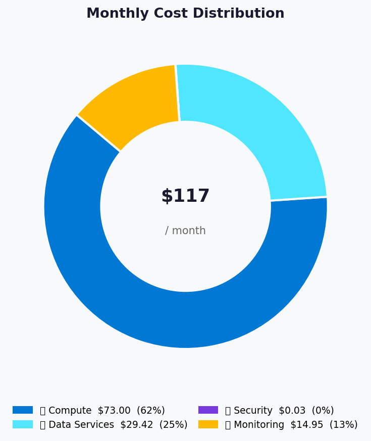
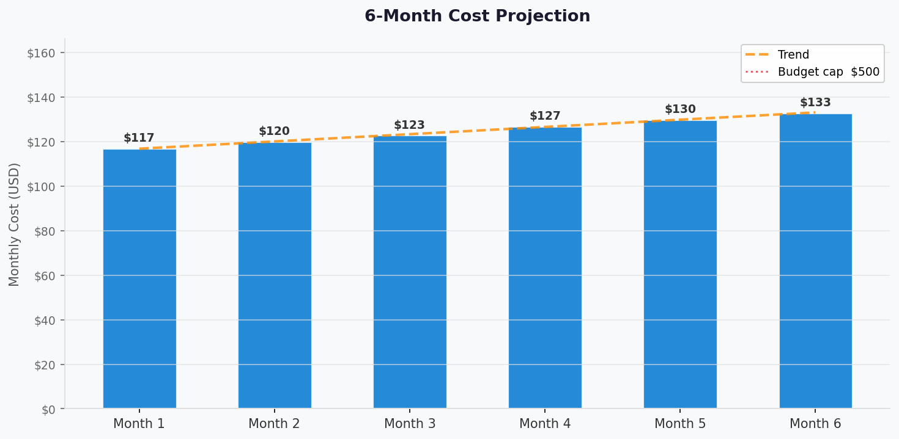

# 💰 Azure Cost Estimate: my-webapp


<details open>
<summary><strong>📑 Cost Estimate Contents</strong></summary>

- [💵 Cost At-a-Glance](#-cost-at-a-glance)
- [✅ Decision Summary](#-decision-summary)
- [🔁 Requirements → Cost Mapping](#-requirements--cost-mapping)
- [📊 Top 5 Cost Drivers](#-top-5-cost-drivers)
- [🏛️ Architecture Overview](#-architecture-overview)
- [🧾 What We Are Not Paying For (Yet)](#-what-we-are-not-paying-for-yet)
- [⚠️ Cost Risk Indicators](#-cost-risk-indicators)
- [🎯 Quick Decision Matrix](#-quick-decision-matrix)
- [💰 Savings Opportunities](#-savings-opportunities)
- [🧾 Detailed Cost Breakdown](#-detailed-cost-breakdown)
- [References](#references)

</details>

> Generated by architect agent | 2026-03-12

| ⬅️ Previous                                                    | 📑 Index            | Next ➡️                                                      |
| -------------------------------------------------------------- | ------------------- | ------------------------------------------------------------ |
| [02-architecture-assessment.md](02-architecture-assessment.md) | [README](README.md) | [04-governance-constraints.md](04-governance-constraints.md) |

**Generated**: 2026-03-12
**Region**: swedencentral
**Environment**: Development + Production
**MCP Tools Used**: azure_cost_estimate, azure_price_search, azure_price_compare, azure_discover_skus
**Architecture Reference**: [02-architecture-assessment.md](02-architecture-assessment.md)

## 💵 Cost At-a-Glance

> **Monthly Total: ~$117.40 (~€108)** | Annual: ~$1,408.80 (~€1,296)
>
> ```text
> Budget: €500–€2,000/month (soft) | Utilization: ~5–22% (~€108 of €500–€2,000)
> ```
>
> | Status            | Indicator                                               |
> | ----------------- | ------------------------------------------------------- |
> | Cost Trend        | ➡️ Stable (linear growth to ~$133/month at 6 months)    |
> | Savings Available | 💰 ~$360/year with Dev/Test pricing for dev environment |
> | Compliance        | ✅ GDPR + SOC 2 aligned (EU data residency, encryption) |

## ✅ Decision Summary

- ✅ Approved: App Service S1, Azure SQL S1, Key Vault Standard, Log Analytics Per-GB, Application Insights workspace-based — all in swedencentral
- ⏳ Deferred: Redis Cache, CDN, Application Gateway/WAF, private endpoints, zone-redundant deployments, reserved instances
- 🔁 Redesign Trigger: Concurrent users exceeding 1,000 sustained (requires S2 SQL or Redis), multi-region requirement (adds ~2× cost), HSM compliance mandate (Key Vault Premium)

**Confidence**: Medium | **Expected Variance**: ±15% (variance driven by actual Log Analytics ingestion volume and SQL DTU utilization patterns)

## 🔁 Requirements → Cost Mapping

| Requirement            | Architecture Decision               | Cost Impact    | Mandatory |
| ---------------------- | ----------------------------------- | -------------- | --------- |
| 99.9% SLA              | S1 App Service + S1 SQL (composite) | Base cost      | Yes       |
| GDPR data residency    | swedencentral region                | No premium     | Yes       |
| SOC 2 audit trail      | KV diagnostic logs + SQL auditing   | +$0 (included) | Yes       |
| <2s page load          | S1 App Service (1 vCPU, 1.75 GB)    | $73.00/month   | Yes       |
| <500ms API p95         | S1 SQL (20 DTU)                     | $29.42/month   | Yes       |
| Centralized secrets    | Key Vault Standard                  | $0.03/month    | Yes       |
| Centralized monitoring | Log Analytics + App Insights        | $14.95/month   | Yes       |

## 📊 Top 5 Cost Drivers

| Rank | Resource              | Monthly Cost | % of Total | Trend      | Optimization                   |
| ---- | --------------------- | ------------ | ---------- | ---------- | ------------------------------ |
| 1️⃣   | App Service Plan S1   | $73.00       | 62.2%      | ➡️ Stable  | Dev/Test pricing or B1 for dev |
| 2️⃣   | Azure SQL Database S1 | $29.42       | 25.1%      | ➡️ Stable  | Monitor DTU; Basic for dev     |
| 3️⃣   | Log Analytics (5 GB)  | $14.95       | 12.7%      | 📈 Growing | Cap ingestion via sampling     |
| 4️⃣   | Key Vault Standard    | $0.03        | 0.0%       | ➡️ Stable  | None needed — negligible cost  |
| 5️⃣   | Application Insights  | $0.00        | 0.0%       | ➡️ Stable  | Included in Log Analytics      |

> 💡 **Quick Win**: Use B1 Basic ($13.14/month) instead of S1 ($73.00/month) for the **dev** environment — saves ~$59.86/month ($718/year) with no impact on production.

<details>
<summary><strong>Cost Driver Details</strong></summary>

#### 1️⃣ App Service Plan S1

| Aspect            | Detail                                                  |
| ----------------- | ------------------------------------------------------- |
| Current SKU       | S1 Standard (Windows)                                   |
| Monthly Cost      | $73.00                                                  |
| Cost Breakdown    | Compute: $73.00 (730 hours × $0.10/hr)                  |
| Optimization      | B1 Basic for dev; Dev/Test subscription pricing for dev |
| Potential Savings | $29.20/month with Dev/Test pricing; $59.86 with B1      |

#### 2️⃣ Azure SQL Database S1

| Aspect            | Detail                                          |
| ----------------- | ----------------------------------------------- |
| Current SKU       | Standard S1 (20 DTU)                            |
| Monthly Cost      | $29.42                                          |
| Cost Breakdown    | Compute + storage bundled (30.4 days × $0.9677) |
| Optimization      | Basic tier for dev (5 DTU, ~$4.90/month)        |
| Potential Savings | $24.52/month using Basic for dev                |

</details>

## 🏛️ Architecture Overview

### Cost Distribution

| Category         | Monthly Cost (USD) | Share |
| ---------------- | -----------------: | ----: |
| 💻 Compute       |             $73.00 | 62.2% |
| 💾 Data Services |             $29.42 | 25.1% |
| 🔒 Security      |              $0.03 |  0.0% |
| 📊 Monitoring    |             $14.95 | 12.7% |



### Month-over-Month Projection

| Month | Est. Users | LA Ingestion | KV Operations | Monthly Cost (USD) |
| ----- | ---------- | ------------ | ------------- | -----------------: |
| 1     | 100        | 5 GB         | 10K           |            $117.40 |
| 2     | 280        | 6 GB         | 28K           |            $120.44 |
| 3     | 460        | 7 GB         | 46K           |            $123.49 |
| 4     | 640        | 8 GB         | 64K           |            $126.53 |
| 5     | 820        | 9 GB         | 82K           |            $129.58 |
| 6     | 1,000      | 10 GB        | 100K          |            $132.62 |

**6-Month Cumulative**: ~$750 (~€690)



### Key Design Decisions Affecting Cost

| Decision                           | Cost Impact  | Business Rationale                                      | Status   |
| ---------------------------------- | ------------ | ------------------------------------------------------- | -------- |
| Public endpoints (no PE)           | -$50/month   | Avoids PE costs; acceptable for initial deploy          | Required |
| Single region                      | -$100+/month | No geo replication cost; DR via manual recovery         | Required |
| Standard tiers (not Premium)       | Baseline     | Matches balanced tier requirements                      | Required |
| Workspace-based App Insights       | $0 extra     | Avoids duplicate ingestion charges                      | Required |
| Per-GB monitoring (not commitment) | Optimal      | Low ingestion volume; commitment tiers waste at <100 GB | Optional |

## 🧾 What We Are Not Paying For (Yet)

- **Private endpoints**: ~$7.30/month each ($0.01/hr) — 3 endpoints = ~$22/month
- **Azure Cache for Redis** (C1 Standard): ~$40/month
- **Application Gateway with WAF v2**: ~$175/month (gateway) + $30/month (WAF policy)
- **Zone-redundant App Service**: requires P1v3+ (~$138/month vs $73 for S1)
- **Geo-redundant SQL backup storage**: ~$2/month premium over LRS
- **DDoS Protection Standard**: ~$2,944/month (not recommended at this scale)

### Assumptions & Uncertainty

- 730 compute hours/month (always-on App Service Plan)
- 5 GB/month initial Log Analytics ingestion; growing linearly to 10 GB at month 6
- ~10,000 Key Vault operations/month (scaling with user growth)
- Application Insights telemetry volume included in Log Analytics ingestion estimate
- SQL data volume <10 GB (well within 250 GB S1 limit)
- No egress costs modeled (minimal cross-region traffic expected)

## ⚠️ Cost Risk Indicators

| Resource           | Risk Level | Issue                                 | Mitigation                                    |
| ------------------ | ---------- | ------------------------------------- | --------------------------------------------- |
| Log Analytics      | 🟡 Medium  | Ingestion spikes from verbose logging | Set daily cap; configure sampling rate        |
| App Service Plan   | 🟢 Low     | Fixed cost regardless of utilization  | Monitor CPU%; downsize to B1 for dev          |
| Azure SQL Database | 🟡 Medium  | DTU exhaustion under unexpected load  | Alert at 80% DTU; upgrade path to S2 ($73.56) |
| Key Vault          | 🟢 Low     | Negligible per-operation cost         | No action needed                              |

> **⚠️ Watch Item**: Log Analytics ingestion is the primary variable cost — uncontrolled diagnostic verbosity could push monitoring costs above the compute baseline.

## 🎯 Quick Decision Matrix

_"If you need X, expect to pay Y more"_

| Requirement                 | Additional Cost | SKU Change               | Verdict        | Notes                                |
| --------------------------- | --------------- | ------------------------ | -------------- | ------------------------------------ |
| 99.99% SLA (zone-redundant) | +$65/month      | S1 → P1v3 zone-redundant | 🟡 Monitor     | Only if SLA requirement increases    |
| Private endpoints (3×)      | +$22/month      | Config change            | 🟢 Go          | Recommended for production hardening |
| Redis caching               | +$40/month      | Add C1 Standard          | 🟡 Monitor     | Trigger at >1K concurrent users      |
| Multi-region failover       | +$120+/month    | Add secondary region     | 🔴 Investigate | Not justified at current scale       |
| WAF + App Gateway           | +$205/month     | Add WAF v2               | 🔴 Investigate | Consider at public-facing scale      |

## 💰 Savings Opportunities

> ### Total Potential Savings: ~$718/year (dev environment optimization)
>
> | Strategy                 | Commitment   | Monthly Savings | Annual Savings | % Reduction |
> | ------------------------ | ------------ | --------------- | -------------- | ----------- |
> | B1 for dev App Service   | N/A          | $59.86          | $718.32        | 51%         |
> | Dev/Test pricing (S1)    | Subscription | $29.20          | $350.40        | 25%         |
> | Basic SQL for dev        | N/A          | $24.52          | $294.24        | 21%         |
> | Log Analytics daily cap  | N/A          | ~$5.00          | ~$60.00        | 4%          |
> | Reserved Instances (SQL) | 1-year       | Not confirmed   | N/A            | N/A         |
>
> **Note**: SQL reserved instances for S1 DTU in swedencentral returned no results via MCP — manual verification recommended for vCore alternatives.

## 🧾 Detailed Cost Breakdown

### Assumptions

- Hours: 730 hours/month (always-on compute)
- Network egress: negligible (single-region, internal traffic)
- Storage growth: <10 GB total in first 6 months

### Line Items

| Category         | Service              | SKU / Meter           | Quantity / Units     | Est. Monthly |
| ---------------- | -------------------- | --------------------- | -------------------- | ------------ |
| 💻 Compute       | App Service Plan     | S1 Standard (Windows) | 730 hours × $0.10/hr | $73.00       |
| 💾 Data Services | Azure SQL Database   | Standard S1 (DTU)     | 30.4 days × $0.9677  | $29.42       |
| 🔒 Security      | Key Vault            | Standard (operations) | 10K ops × $0.03/10K  | $0.03        |
| 📊 Monitoring    | Log Analytics        | Analytics Logs        | 5 GB × $2.99/GB      | $14.95       |
| 📊 Monitoring    | Application Insights | Workspace-based       | Included in LA       | $0.00        |
|                  | **Total**            |                       |                      | **$117.40**  |

### Notes

- All prices MCP-verified via `azure_cost_estimate` and `azure_price_search` (2026-03-12)
- Application Insights uses workspace-based model — telemetry ingestion counted in Log Analytics line item
- Key Vault cost rounded from $0.03 per 10,000 operations — negligible at projected volume
- Dev environment recommendation: B1 App Service ($13.14) + Basic SQL ($4.90) = ~$33/month for dev
- EUR conversion at 0.92 rate: $117.40 × 0.92 = €108.01/month

---

## References

| Topic                    | Link                                                                                                                   |
| ------------------------ | ---------------------------------------------------------------------------------------------------------------------- |
| Azure Pricing Calculator | [Calculator](https://azure.microsoft.com/pricing/calculator/)                                                          |
| Cost Management          | [Overview](https://learn.microsoft.com/azure/cost-management-billing/costs/overview-cost-management)                   |
| Reserved Instances       | [Reservations](https://learn.microsoft.com/azure/cost-management-billing/reservations/save-compute-costs-reservations) |
| WAF Cost Optimization    | [Checklist](https://learn.microsoft.com/azure/well-architected/cost-optimization/checklist)                            |

---

<div align="center">

| ⬅️ [02-architecture-assessment.md](02-architecture-assessment.md) | 🏠 [Project Index](README.md) | ➡️ [04-governance-constraints.md](04-governance-constraints.md) |
| ----------------------------------------------------------------- | ----------------------------- | --------------------------------------------------------------- |

</div>
