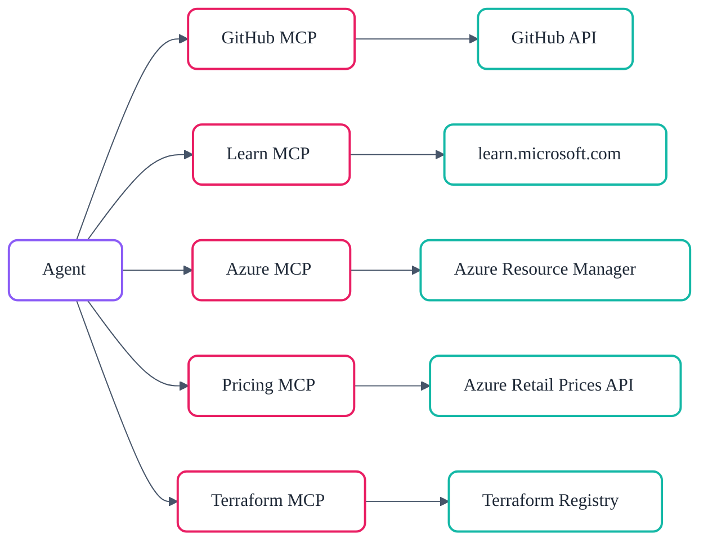

# :material-connection: MCP Server Integration

The Model Context Protocol (MCP) is an open standard that allows AI agents to
discover and invoke external tools through a uniform JSON-RPC interface.
This project integrates five MCP servers, each providing specialised
capabilities that agents invoke at runtime.

## :material-lan: MCP Architecture

All MCP servers are declared in `.vscode/mcp.json` and start automatically
when VS Code invokes them. Agents never call cloud APIs directly — they
call MCP tools, which handle authentication, caching, pagination, retries,
and response formatting.



## :octicons-mark-github-16: GitHub MCP Server

| Property  | Value                                         |
| --------- | --------------------------------------------- |
| Transport | HTTP                                          |
| Endpoint  | `https://api.githubcopilot.com/mcp/`          |
| Auth      | Automatic via GitHub Copilot token            |
| Purpose   | Issues, PRs, repos, code search, file content |

The GitHub MCP server is the primary interface for repository operations.
Agents use it to create issues, open pull requests, search code, read file
contents, manage branches, and automate the Smart PR Flow lifecycle. It is
scoped as a default server — every agent has access.

## :material-school-outline: Microsoft Learn MCP Server

| Property  | Value                                    |
| --------- | ---------------------------------------- |
| Transport | HTTP                                     |
| Endpoint  | `https://learn.microsoft.com/api/mcp`    |
| Auth      | None (public API)                        |
| Purpose   | Azure docs, SDK references, code samples |

The Microsoft Learn MCP server provides access to official Microsoft
documentation. Agents query it to look up Azure service limits, find
quickstart guides, verify SDK method signatures, and discover best
practices. The `microsoft-docs` and `microsoft-code-reference` skills
are built on top of this server. It is scoped as a default server alongside
GitHub.

## :material-microsoft-azure: Azure MCP Server

| Property  | Value                                        |
| --------- | -------------------------------------------- |
| Transport | VS Code Copilot Extension                    |
| Extension | `ms-azuretools.vscode-azure-mcp-server`      |
| Auth      | Azure CLI (`az login`) or managed identity   |
| Purpose   | RBAC-aware Azure resource context for agents |

The Azure MCP Server is a **critical component** installed as a VS Code
extension. It provides agents with direct, RBAC-aware access to
Azure Resource Manager for querying subscriptions, resource groups,
resources, deployments, and policy assignments. Unlike the Azure Pricing
MCP server (which queries public pricing APIs), this server operates
against live Azure environments using the authenticated user's credentials.

Agents use it across the entire workflow — from governance discovery
(querying Azure Policy assignments) through deployment (validating
resource state) to as-built documentation (inventorying deployed resources).
It is scoped as a **default server** alongside GitHub and Microsoft Learn,
meaning virtually every agent has access.

Installation follows the [Azure MCP Server README](https://github.com/microsoft/mcp/blob/main/servers/Azure.Mcp.Server/README.md#installation)
and is pre-configured in the dev container via the
`ms-azuretools.vscode-azure-mcp-server` extension.

## :material-currency-usd: Azure Pricing MCP Server

| Property  | Value                                                 |
| --------- | ----------------------------------------------------- |
| Transport | stdio                                                 |
| Command   | Python (`azure_pricing_mcp` module)                   |
| Auth      | None for pricing; Azure credentials for Spot VM tools |
| Tools     | 13 tools                                              |
| Source    | `mcp/azure-pricing-mcp/` (custom, built in-repo)      |

This is a **custom MCP server built specifically for this project**. It
queries the [Azure Retail Prices API](https://learn.microsoft.com/en-us/rest/api/cost-management/retail-prices/azure-retail-prices)
and provides 13 tools for cost estimation:

| Tool                     | Purpose                                      |
| ------------------------ | -------------------------------------------- |
| `azure_price_search`     | Search retail prices with filters            |
| `azure_price_compare`    | Compare prices across regions/SKUs           |
| `azure_cost_estimate`    | Estimate costs based on usage                |
| `azure_discover_skus`    | List available SKUs for a service            |
| `azure_sku_discovery`    | Intelligent SKU name matching                |
| `azure_region_recommend` | Find cheapest regions                        |
| `azure_ri_pricing`       | Reserved Instance pricing and savings        |
| `azure_bulk_estimate`    | Multi-resource estimate in one call          |
| `azure_cache_stats`      | API cache hit/miss statistics                |
| `get_customer_discount`  | Customer discount percentage                 |
| `spot_eviction_rates`    | Spot VM eviction rates (requires Azure auth) |
| `spot_price_history`     | Spot VM price history (90 days)              |
| `simulate_eviction`      | Simulate Spot VM eviction                    |

The server includes a 256-entry TTL cache (5-minute pricing, 24-hour
retirement data, 1-hour spot data), ~95 user-friendly service name
mappings (e.g. `"vm"` → `"Virtual Machines"`), and structured error
codes for consistent agent error handling.

Primarily scoped to the **Architect** agent (Step 2), the
**cost-estimate-subagent**, and the **As-Built** agent (Step 7).

## :material-terraform: Terraform Registry MCP Server

| Property  | Value                                     |
| --------- | ----------------------------------------- |
| Transport | stdio                                     |
| Command   | Go binary (`terraform-mcp-server`)        |
| Toolsets  | `registry`                                |
| Purpose   | Provider/module lookup, version discovery |

The Terraform MCP server provides registry integration for the Terraform
IaC track. Agents use it to discover the latest provider and module
versions, look up provider capabilities (resources, data sources, functions),
and retrieve module details before generating Terraform configurations.

Scoped exclusively to the **Terraform Planner** (Step 4t), **Terraform
CodeGen** (Step 5t), **terraform-lint-subagent**, and
**terraform-review-subagent**.

## :material-file-tree-outline: File Map

```text
AGENTS.md                                    # Table of contents for all agents
.github/
  copilot-instructions.md                    # VS Code Copilot orchestration
  agent-registry.json                        # Agent role → file/model/skills
  skill-affinity.json                        # Skill/agent affinity weights
  agents/                                    # 14 top-level agent definitions
    _subagents/                              # 9 subagent definitions
  skills/                                    # 21 skill packages
    workflow-engine/                          # DAG, workflow graph
    context-shredding/                       # Runtime compression
    session-resume/                          # State tracking + resume protocol
    golden-principles/                       # 10 operating principles
    azure-defaults/                          # Regions, tags, naming, security
    azure-artifacts/                         # Template structures + H2 rules
    azure-bicep-patterns/                    # Bicep composition patterns
    terraform-patterns/                      # Terraform composition patterns
    iac-common/                              # Deploy patterns + circuit breaker
    github-operations/                       # GitHub MCP + CLI + Smart PR Flow
    ...
  instructions/                              # 27 instruction files (glob-based)
agent-output/{project}/                      # All agent-generated artefacts
  00-session-state.json                      # Machine-readable workflow state
  00-handoff.md                              # Human-readable gate summary
  01-requirements.md → 07-*.md               # Step artefacts
infra/
  bicep/{project}/                           # Bicep templates
  terraform/{project}/                       # Terraform configurations
scripts/                                     # 27 validation scripts
mcp/azure-pricing-mcp/                       # Custom Azure Pricing MCP server
```
