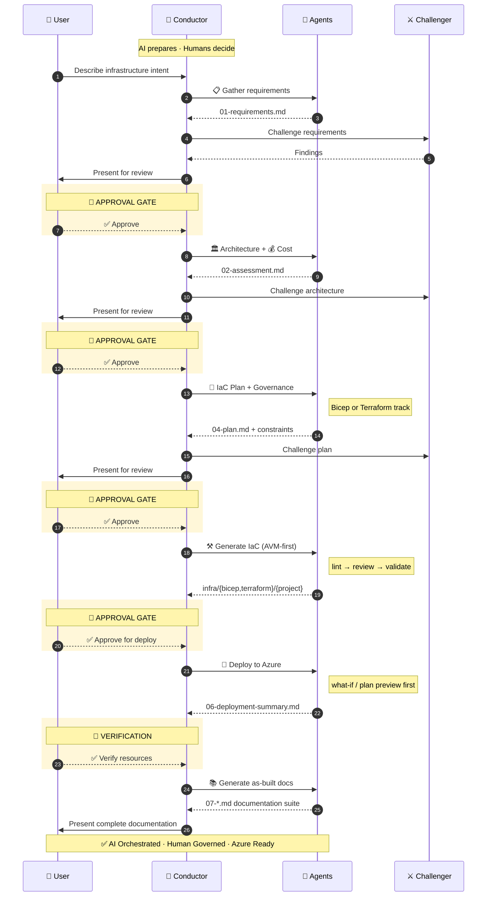

<!-- MkDocs landing page — source of truth is this file -->

# Agentic InfraOps

Transform Azure infrastructure requirements into deploy-ready IaC code (Bicep or Terraform)
using coordinated AI agents and reusable skills, aligned with the Azure Well-Architected
Framework and Azure Verified Modules.

**Who is this for?** DevOps engineers, platform engineers, and IT Pros who want to
accelerate Azure infrastructure delivery with AI-assisted workflows.

[Get Started](quickstart.md){ .md-button .md-button--primary }
[Use the Template](https://github.com/jonathan-vella/azure-agentic-infraops-accelerator){ .md-button }

---

## :material-compass-outline: Explore the Documentation

- :material-rocket-launch:{ .lg .middle } **Getting Started**

  ***

  Set up from the Accelerator template and run your first agent workflow in 10 minutes.

  [:octicons-arrow-right-24: Quickstart](quickstart.md)

- :material-cog-outline:{ .lg .middle } **How It Works**

  ***

  Understand the multi-agent architecture, skills system, and 7-step workflow.

  [:octicons-arrow-right-24: How It Works](how-it-works/index.md)

- :material-chart-timeline-variant:{ .lg .middle } **Workflow**

  ***

  The 7-step journey from requirements to deployed infrastructure with approval gates.

  [:octicons-arrow-right-24: Workflow](workflow.md)

- :material-console:{ .lg .middle } **Prompt Guide**

  ***

  Ready-to-use prompt examples for every agent and skill.

  [:octicons-arrow-right-24: Prompt Guide](prompt-guide/index.md)

- :material-wrench-outline:{ .lg .middle } **Troubleshooting**

  ***

  Common issues, diagnostic decision tree, and solutions.

  [:octicons-arrow-right-24: Troubleshooting](troubleshooting.md)

- :material-book-open-variant:{ .lg .middle } **Glossary**

  ***

  Quick reference for terms used throughout the documentation.

  [:octicons-arrow-right-24: Glossary](GLOSSARY.md)

- :material-frequently-asked-questions:{ .lg .middle } **FAQ**

  ***

  Answers to common questions about the project, models, and customization.

  [:octicons-arrow-right-24: FAQ](faq.md)

- :material-heart-outline:{ .lg .middle } **Contributing**

  ***

  Guidelines for contributing agents, skills, documentation, and IaC patterns.

  [:octicons-arrow-right-24: Contributing](CONTRIBUTING.md)

---

## :material-chart-box-outline: Key Facts

|                 |                                                    |
| --------------- | -------------------------------------------------- |
| **Agents**      | 15 primary + 9 validation subagents                |
| **Skills**      | 21 reusable domain knowledge modules               |
| **IaC Tracks**  | Bicep and Terraform (dual-track)                   |
| **MCP Servers** | Azure, Pricing, Terraform, GitHub, Microsoft Learn |
| **Workflow**    | 7 steps with mandatory approval gates              |

## :material-star-outline: Highlights

See the [Changelog](CHANGELOG.md) for the full release history.

- **v0.10.0** — Workflow Engine DAG, Context Shredding, Circuit Breaker pattern, session lock model
- **v0.9.0** — Dual IaC Track (Bicep + Terraform), Challenger Agent, 20 skills, Fast Path Conductor

---

## :material-lifebuoy: Getting Help

- **Issues**: [GitHub Issues](https://github.com/jonathan-vella/azure-agentic-infraops/issues)
- **Discussions**: [GitHub Discussions](https://github.com/jonathan-vella/azure-agentic-infraops/discussions)
- **Troubleshooting**: [Troubleshooting Guide](troubleshooting.md)
- **MicroHack**: [Hands-on guided challenge](https://jonathan-vella.github.io/microhack-agentic-infraops/)
  — build Azure infrastructure end-to-end using AI agents
