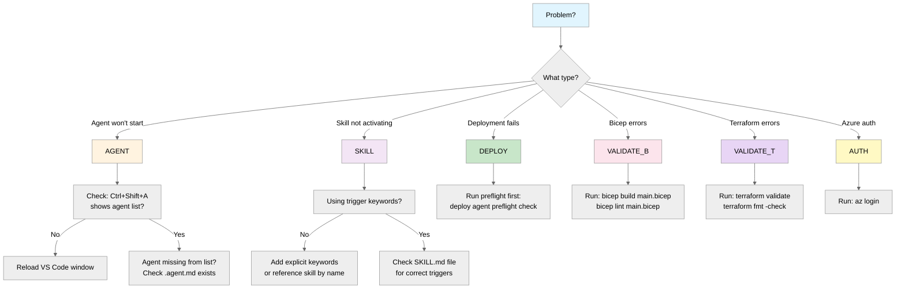

<div align="center">
  
</div>

# :material-wrench-outline: Troubleshooting Guide

> Common issues and solutions for Agentic InfraOps

## :material-account-card-outline: Agent Personas Quick Reference

| Agent              | Persona       | Common Issues                    |
| ------------------ | ------------- | -------------------------------- |
| InfraOps Conductor | 🎼 Maestro    | Subagent invocation not working  |
| requirements       | 📜 Scribe     | Not appearing in list            |
| architect          | 🏛️ Oracle     | MCP pricing not connecting       |
| bicep-planner      | 📐 Strategist | Governance discovery failing     |
| terraform-planner  | 📐 Strategist | Governance discovery failing     |
| bicep-codegen      | ⚒️ Forge      | Validation subagents not running |
| terraform-codegen  | ⚒️ Forge      | Provider version mismatches      |
| bicep-deploy       | 🚀 Envoy      | Azure auth issues                |
| terraform-deploy   | 🚀 Envoy      | State lock / init failures       |
| challenger         | ⚔️ Challenger | —                                |
| diagnose           | 🔍 Sentinel   | —                                |

## :material-sitemap-outline: Quick Decision Tree



## :material-alert-circle-outline: Common Issues

### 1. Agent Not Appearing in List

**Symptom**: `Ctrl+Shift+A` doesn't show expected agent.

**Causes**:

- Agent file not in `.github/agents/` folder
- YAML front matter syntax error
- VS Code extension not loaded

**Solutions**:

```bash
# Check agent files exist
ls -la .github/agents/*.agent.md

# Validate YAML front matter
head -20 .github/agents/requirements.agent.md
```

Reload VS Code: `Ctrl+Shift+P` → "Developer: Reload Window"

### 2. Conductor/Subagent Invocation Not Working (VS Code 1.109+)

**Symptom**: The InfraOps Conductor (🎼 Maestro) doesn't delegate to specialized agents.
Responses are instant, no terminal commands execute, no files are created.

**Root Cause**: The `chat.customAgentInSubagent.enabled` setting is not enabled in
**User Settings**.

**Solutions**:

1. **Enable in User Settings** (not just workspace):
   - Press `Ctrl+,` → Search for `customAgentInSubagent`
   - Check the box to enable
   - OR add to User Settings JSON:

   ```json
   {
     "chat.customAgentInSubagent.enabled": true
   }
   ```

2. **Verify agents have `agent` tool**:

   ```bash
   grep -l '"agent"' .github/agents/*.agent.md
   # Should list all main agents
   ```

3. **Verify agents have wildcard `agents` array**:

   ```bash
   grep 'agents:.*\["\*"\]' .github/agents/*.agent.md
   # Should show agents: ["*"] in each file
   ```

4. **Use Chat Diagnostics**:
   - Right-click in Chat view → "Diagnostics"
   - Check all agents are loaded correctly

**Note**: Workspace settings (`.vscode/settings.json`) may not be sufficient
for experimental features. User settings take precedence.

### 3. Skill Not Activating Automatically

**Symptom**: Prompt doesn't trigger expected skill.

**Causes**:

- Missing trigger keywords in prompt
- Skill file not in `.github/skills/` folder
- Description doesn't match user intent

**Solutions**:

Use explicit skill invocation:

```text
"Use the azure-diagrams skill to create a diagram"
```

Check skill triggers in `SKILL.md`:

```bash
cat .github/skills/azure-diagrams/SKILL.md | head -30
```

### 4. Deployment Fails with Azure Policy Error

**Symptom**: `az deployment group create` fails with policy violation.

**Common policies**:

| Error             | Cause                     | Solution                                                                                |
| ----------------- | ------------------------- | --------------------------------------------------------------------------------------- |
| "Azure AD only"   | SQL Server needs AAD auth | Set `azureADOnlyAuthentication: true`                                                   |
| "Zone redundancy" | Wrong SKU tier            | Use P1v4+ for App Service                                                               |
| "Missing tags"    | Required tags absent      | Add baseline tags (see `bicep-code-best-practices.instructions.md`) + governance extras |

**Run preflight check**:

```text
"Run deployment preflight for {project}"
```

### 5. Bicep Build Errors

**Symptom**: `bicep build` fails.

=== "Bicep"

    **Common causes**:

    ```bash
    # Check Bicep CLI version
    bicep --version  # Should be 0.30+

    # Validate syntax
    bicep lint infra/bicep/{project}/main.bicep
    ```

    **AVM module not found**:

    ```bash
    # Restore modules from registry
    bicep restore infra/bicep/{project}/main.bicep
    ```

### 5t. Terraform Validation Errors

**Symptom**: `terraform validate` or `terraform plan` fails.

=== "Terraform"

    **Common causes and solutions**:

    ```bash
    # Check Terraform CLI version
    terraform --version  # Should be 1.5+

    # Initialize providers (run from project directory)
    cd infra/terraform/{project}
    terraform init -backend=false

    # Check formatting
    terraform fmt -check -recursive

    # Validate configuration
    terraform validate
    ```

    **Provider version mismatch**:

    ```bash
    # Lock providers to specific versions
    terraform providers lock -platform=linux_amd64
    ```

    **AVM-TF module not found**:

    Verify the module source in `main.tf` matches the Terraform Registry path:

    ```hcl
    # Correct AVM-TF module source pattern
    module "example" {
      source  = "Azure/avm-res-<provider>-<resource>/azurerm"
      version = "~> 0.x"
    }
    ```

    **TFLint errors**:

    ```bash
    # Run TFLint with Azure ruleset
    tflint --init
    tflint --recursive
    ```

**State lock issues**:

!!! danger "Destructive Operation"

    `terraform force-unlock` can corrupt state if used while another operation is
    genuinely in progress. Only use when you are certain the lock is stale.

```bash
terraform force-unlock <lock-id>
```

### 6. Azure Authentication Issues

**Symptom**: "Not logged in" or subscription errors.

**Solutions**:

```bash
# Login to Azure
az login

# Set correct subscription
az account set --subscription "<subscription-id>"

# Verify
az account show
```

For Service Principal:

```bash
az login --service-principal -u $AZURE_CLIENT_ID -p $AZURE_CLIENT_SECRET --tenant $AZURE_TENANT_ID
```

### 7. Artifact Validation Failures

**Symptom**: `npm run validate` fails.

**Causes**:

- Missing required H2 headings
- Headings in wrong order
- Using prohibited references

**Check specific artifact**:

```bash
# See validation rules
cat scripts/validate-artifact-templates.mjs | grep -A20 "ARTIFACT_HEADINGS"
```

**Fix order issues**: Compare with template:

```bash
diff -u .github/skills/azure-artifacts/templates/01-requirements.template.md agent-output/{project}/01-requirements.md
```

### 8. MCP Server Not Responding

**Symptom**: Azure Pricing MCP calls fail.

**Solutions**:

```bash
# Check MCP configuration
cat .vscode/mcp.json

# Verify Python environment
python3 --version  # Should be 3.10+

# Install dependencies
cd mcp/azure-pricing-mcp && pip install -r requirements.txt
```

!!! tip "Graceful degradation"

    If MCP servers are temporarily unreachable, the workflow degrades gracefully.
    Steps 1-5 can proceed without MCP — agents skip real-time pricing lookups
    and use documented defaults. Governance discovery in Step 4 uses Azure CLI
    auth, not MCP. Only Step 2 cost estimation and Step 7 as-built cost updates
    depend directly on the Pricing MCP server.

### 9. Dev Container Build Fails

**Symptom**: Dev container won't start.

**Common causes**:

- Docker not running
- Port conflicts
- Outdated base image

**Solutions**:

```bash
# Rebuild without cache
# In VS Code: Ctrl+Shift+P → "Dev Containers: Rebuild Container Without Cache"
```

Check Docker is running:

```bash
docker ps
```

### 10. Orphaned VS Code Extensions Injecting Unwanted Instructions

**Symptom**: Copilot loads instruction files from extensions that are not listed in `devcontainer.json`
(e.g., `ms-azuretools.vscode-azure-github-copilot`). You may see unexpected rules or context being
injected into agent conversations.

**Cause**: Extension directories can persist in `~/.vscode-server/extensions/` even after an extension
is removed from the `devcontainer.json` extensions list. VS Code auto-loads instruction files from any
extension on disk, regardless of whether it is actively managed.

**Solution**:

1. List orphaned extensions:

   ```bash
   # Compare installed extensions against devcontainer.json
   ls ~/.vscode-server/extensions/ | sort > /tmp/installed.txt
   # Look for anything not in your devcontainer.json extensions list
   ```

2. Remove the orphaned extension directory:

   ```bash
   rm -rf ~/.vscode-server/extensions/<orphaned-extension-folder>
   ```

3. Reload the VS Code window (`Ctrl+Shift+P` → "Developer: Reload Window").

> **Note**: Orphaned extensions may reappear after a dev container rebuild from a cached Docker layer.
> If this happens, rebuild without cache:
> `Ctrl+Shift+P` → "Dev Containers: Rebuild Container Without Cache".

### 11. Git Push Fails with Lefthook Errors

**Symptom**: Pre-commit hooks fail.

**Common hooks**:

| Hook                | Command            | Fix                            |
| ------------------- | ------------------ | ------------------------------ |
| Artifact validation | `npm run validate` | Fix H2 structure               |
| Markdown lint       | `npm run lint:md`  | Fix markdown issues            |
| Commitlint          | `commitlint`       | Use conventional commit format |

**Skip hooks temporarily** (not recommended):

!!! danger "Use with caution"

    Skipping hooks bypasses all validation. Only use for emergency fixes that you will
    immediately follow up with a proper commit.

```bash
git commit --no-verify -m "fix: temporary"
```

### 12. Handoff Prompt Not Working

**Symptom**: Agent handoff button does nothing.

**Causes**:

- Handoff target agent doesn't exist
- YAML handoffs section malformed

**Check handoffs syntax**:

```yaml
handoffs:
  - label: "Create WAF Assessment"
    agent: architect
    prompt: "Assess requirements for WAF..."
    send: true
```

Ensure target agent exists:

```bash
ls .github/agents/architect.agent.md
```

## Diagnostic Commands

### Environment Check

```bash
# All-in-one status
echo "=== Bicep ===" && bicep --version
echo "=== Terraform ===" && terraform --version
echo "=== TFLint ===" && tflint --version
echo "=== Azure CLI ===" && az version --output table
echo "=== Node ===" && node --version
echo "=== Python ===" && python3 --version
echo "=== Git ===" && git --version
```

### Workspace Validation

```bash
# Validate all artifacts
npm run validate:all

# Bicep validation
bicep lint infra/bicep/{project}/main.bicep
bicep build infra/bicep/{project}/main.bicep

# Terraform validation
cd infra/terraform/{project} && terraform init -backend=false && terraform validate
npm run validate:terraform

# Lint markdown
npm run lint:md
```

### Azure Status

```bash
# Current subscription
az account show --output table

# List resource groups
az group list --output table

# Check deployments
az deployment group list -g {resource-group} --output table
```

## Getting Help

1. **Check prompt guide**: [Prompt Guide](prompt-guide/index.md) has usage examples
2. **Read agent definitions**: `.github/agents/*.agent.md`
3. **Check skill files**: `.github/skills/*/SKILL.md`
4. **Review templates**: `.github/skills/azure-artifacts/templates/`

### Still Stuck?

Use the `diagnose` agent (🔍 Sentinel):

```text
Ctrl+Shift+A → diagnose
"My bicep-code agent isn't generating valid templates"
```

Or start the InfraOps Conductor (🎼 Maestro) for a guided workflow:

```text
Ctrl+Shift+I → InfraOps Conductor
"Help me troubleshoot my Azure deployment"
```
